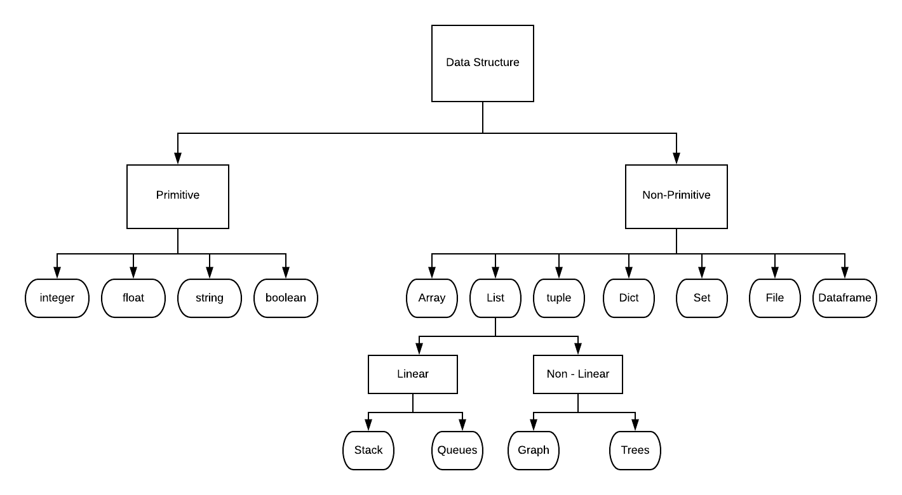

### DATA STRUCTURE
Data structures are a way of organizing and storing data so that they can be accessed and worked with efficiently. They define the relationship between the data, and the operations that can be performed on the data.

1. Tuple  
is a collection which is **ordered** and **unchangeable**. Allows duplicate members.  
x = ("a", "b", "c")
2. List  
is a collection which is **ordered** and **changeable**. Allows duplicate members. 
x = ["a", "b", "c"]
3. Dict  
is a collection which is **unordered**, **changeable and indexed**. No duplicate members.  
x = {
  "brand": "Fer",
  "loc": "Malang",
  "year": 2009
}
4. Set  
is a collection which is **unordered** and **unindexed**. No duplicate members.  
x = {"a", "b", "c"}

5. Array  
is a sequential arrangement of data elements paired with the index of the data element. Only Array can do mathematical operation.

6. Dataframe  
is two-dimensional size-mutable, potentially heterogeneous tabular data structure with labeled axes (rows and columns). 

### Refference
1. Data Camp (https://www.datacamp.com/community/tutorials/data-structures-python?)
2. w3schools (https://www.w3schools.com/python/python_datatypes.asp)

